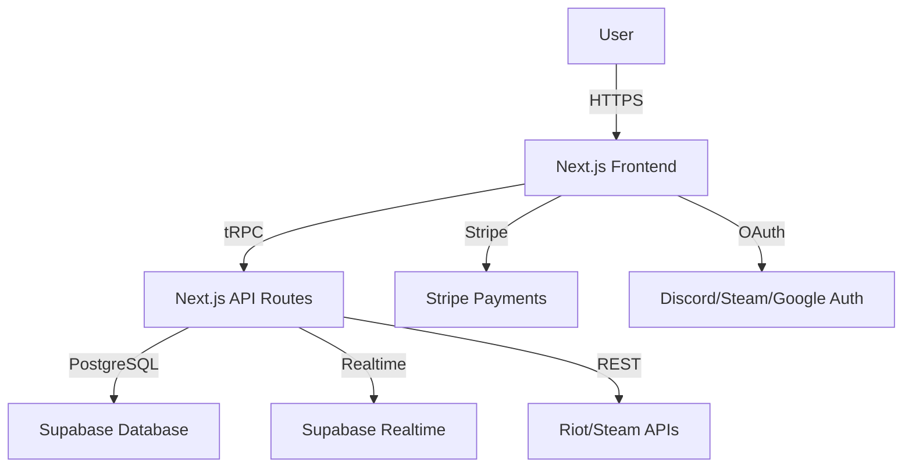

# Architecture Overview

## 1. High-Level Architecture

## 2. Components

### 2.1 Frontend (Next.js)
- **Pages:**
  - `/tournaments` – Tournament listings and creation.
  - `/teams` – Team management and invites.
  - `/matches` – Live match scores and history.
  - `/leaderboard` – Global and per-game rankings.
  - `/admin` – Admin panel for orgs.
- **UI:** Tailwind CSS, reusable components.
- **State:** React Query for data fetching.

### 2.2 Backend (Next.js API Routes + tRPC)
- **tRPC Routers:**
  - `tournamentRouter` – CRUD for tournaments.
  - `teamRouter` – Team management.
  - `matchRouter` – Match results and stats.
  - `userRouter` – User profiles and auth.
- **Services:**
  - `supabaseService` – Database interactions.
  - `stripeService` – Payment processing.
  - `realtimeService` – Live updates.

### 2.3 Database (Supabase)
- **Tables:**
  - `users` – User profiles and roles.
  - `teams` – Team rosters and invites.
  - `tournaments` – Tournament details and brackets.
  - `matches` – Match results and stats.
  - `leaderboards` – Rankings and scores.
- **Realtime:** Supabase Realtime for live scores and chat.

### 2.4 Integrations
- **Auth:** Supabase Auth (email, Discord, Steam, Google).
- **Payments:** Stripe (subscriptions, entry fees).
- **Game APIs:** Riot, Steam (match history, player stats).
- **Notifications:** Supabase Realtime + Email.

## 3. Data Flow

1. **User creates a tournament** → Frontend → tRPC → Supabase.
2. **User joins a team** → Frontend → tRPC → Supabase.
3. **Match result submitted** → Frontend → tRPC → Supabase → Realtime updates.
4. **Leaderboard updates** → Supabase triggers → Realtime → Frontend.

## 4. Deployment

- **Frontend:** Vercel (static + serverless functions).
- **Backend:** Vercel (API routes) + Supabase (database).
- **CI/CD:** GitHub Actions (tests, linting, deployment).

## 5. Scalability

- **Horizontal Scaling:** Vercel auto-scales Next.js apps.
- **Database:** Supabase handles PostgreSQL scaling.
- **Caching:** React Query for frontend caching.
- **CDN:** Vercel Edge Network for static assets.